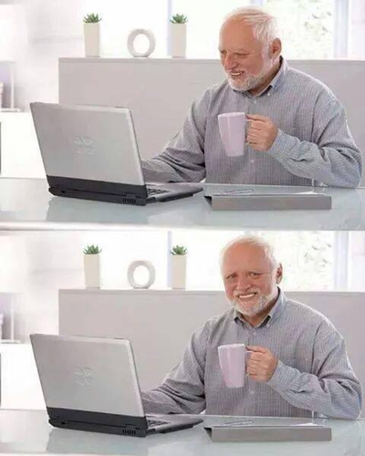
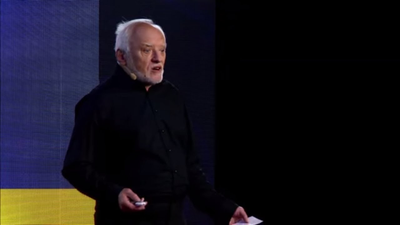

# Harold Meme Image Reference

*The official Hide the Pain Harold meme placement guide for EraserHead documentation*

**Last Updated**: February 12, 2026

---

## The Meme Collection

EraserHead uses resized Harold meme images from various public sources — placed at contextually appropriate spots in documentation.

### Available Images

| Image | File | Source | Used In |
|-------|------|--------|---------|
|  | `harold-laptop.png` | Wikipedia (classic stock photo) | README.md |
|  | `harold-thumbsup.png` | KnowYourMeme entry icon | CONTRIBUTING.md |
|  | `harold-imgflip.png` | Imgflip meme template | CONSTITUTION.md |
|  | `harold-tedx.png` | TEDx Kyiv 2018 thumbnail | API Reference |
|  | `harold-buzzfeed.png` | BuzzFeed interview thumbnail | Adapter Development |
|  | `harold-documentary.png` | Documentary still | User Guide |

All images resized to 400px width, PNG format.

---

## Placement Guidelines

- **One image per doc header.** Don't overdo it.
- **Different image per doc.** Variety is the spice of Harold.
- **Use `width="400"` or `width="300"`** to keep things reasonable.
- **Centered with `<p align="center">`** for clean presentation.

---

## Regeneration

```bash
python scripts/fetch-harold-memes.py
```

For sourcing details, copyright, and Harold lore, see [MEME-GALLERY.md](MEME-GALLERY.md).
